# Game Bricked 🧱

*"A story of one small emulator and many bricks it takes for it to run a game."*

**GameBoy**, DMG-01, game brick, no matter what you call it, its name brings joy and a bunch of sweet memories. Even thought this system predates me quite a bit, it's legacy echoes trough the gaming industry till this very day. Kirby, Pokemon, Tetris. Everybody knows these games. And they all have found first success on the GameBoy. It's hard not to see the influence of the grandpa of handheld gaming, even if it eats through 4 AA Batteries at a time. Keeping all of that in mind, it's hard not to adore this technological marvel of a handheld.

I'm Noelle Stern and on this page I want to tell a story of building my own cozy little emulator.

- [Game Bricked 🧱](#game-bricked-)
  - [How did I even end up here? 📍](#how-did-i-even-end-up-here-)
  - [Brick 0 - Where to start? 🚩](#brick-0---where-to-start-)
    - [A simple entrypoint - Cartridge header 🎯](#a-simple-entrypoint---cartridge-header-)
  - [Brick 1 - Basic architecture 🧩](#brick-1---basic-architecture-)
    - [CPU registers 🧾](#cpu-registers-)
    - [OpCodes 🧠](#opcodes-)
    - [Memory 💾](#memory-)
    - [Boot ROM 🥾](#boot-rom-)
      - [Boot ROM extraction ⛏️](#boot-rom-extraction-️)
    - [Faking the screen 📺](#faking-the-screen-)
    - [Debugging 🐛](#debugging-)
    - [Afterword 🕓](#afterword-)
  - [Detour 1 - Piping into FFmpeg 🎬](#detour-1---piping-into-ffmpeg-)

## How did I even end up here? 📍

Recently I've stumbled upon [this YouTube video](https://www.youtube.com/watch?v=hy2yY5a1Z-0) suggesting viewers try building their own **GameBoy emulator**. I was always interested in retro tech and so I immediately thought it'd be a good sport worth trying. Original GameBoy also know as DMG-01 seems at the same time **simple and complex** enough to give almost any programmer some nice challenge. And I love a good challenge.

**Emulation** generally is a fascinating phenomenon to me. Forcing something made for an entirely different system work on another is almost like **magic**.<br>
*(Insert an Umineko joke here)*

And just like that, I decided to give it a fair shot! Luckily, for anyone embarking on this journey, the game brick is one of the most well documented pieces of hardware ever. There are obscure forums, stray personal web pages, random github projects, good old youtube videos and entire discord servers all documenting GameBoy's inner workings in one way or another. Some focus on the actual hardware, while other report about emulator development.

The most useful webpages in my opinion are the following:
- [Pan Docs](https://gbdev.io/pandocs/) and [Emulator Development](https://gbdev.io/resources.html#emulator-development)
- [OpCode Table](https://meganesu.github.io/generate-gb-opcodes/) and [Original OpCode Table](https://www.pastraiser.com/cpu/gameboy/gameboy_opcodes.html)
- [RGBDS OpCode reference](https://rgbds.gbdev.io/docs/v1.0.1/gbz80.7)

*And that's how my adventure began!*

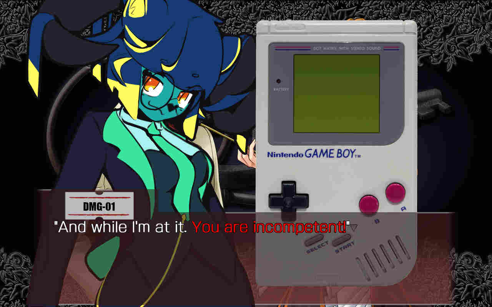

## Brick 0 - Where to start? 🚩

First things first - I had to pick a **programming language**. And it actually wasn't all that hard at all. Recently I was enjoying writing in **Rust** and it's a genuinely great choice. It's stupidly fast, strictly typed and it's ownership model is simply brilliant. It also trivializes working with overflows with a few useful built-in commands:

```rust
// Wrapping functions example
let mut v1: u8 = u8::MAX; // =255
v1 = v1.wrapping_add(1); // =0
assert_eq!(0, v1);

let mut v2: u8 = u8::MIN; // =0
v2 = v2.wrapping_sub(1); // =255
assert_eq!(255, v2);

// Overflowing functions example
let (result, overflow_flag) = v2.overflowing_add(1);
assert_eq!(0, result);
assert_eq!(true, overflow_flag);

let (result, overflow_flag) = v1.overflowing_sub(1);
assert_eq!(255, result);
assert_eq!(true, overflow_flag);
```

I feel like making an emulator in Rust became somewhat of a mainstream lately, so you can be the one to go against the trends and do it in a harder better faster stronger way. You're free to use most any other programming language to get the job done as well.

That being out of the way, the first thing I actually had to do is to learn a little about the GameBoy. To initially familiarize myself with the core concepts I've watched [Ryan Levick: Oh Boy!](https://www.youtube.com/watch?v=B7seNuQncvU) RustFest conference talk.

Retroactively, even though I didn't watch it at that point yet, I can really recommend [The Ultimate Game Boy Talk](https://www.youtube.com/watch?v=HyzD8pNlpwI). It's an amazing breakdown featuring some great visuals of all of the important things you'll be interacting with on your way.

I said "learn a little", but prepare to learn a lot. To make an emulator you have to know the inner workings of the source system almost religiously. To a point you could be be suddenly woken up in the middle of the night and answer what flag register does, for example. It's somewhat of an exaggeration, but the amount of information is quite baffling. All of the console systems are deeply interwoven together and it doesn't make it easier either. But it's a part of the fun as well! Seeing all of the separate code pieces come together brings a lot of joy.

For all intents and purposes, **GameBoy is a basic computer**. The most basic computer consists of a `CPU`, `RAM` and `ROM`. `ROM` is used to provide instructions, `CPU` executes said instructions and `RAM` stores the results of those instructions. Since those are required components of any computer, those also are the most interwoven together elements of a GameBoy. Everything else like screen, buttons or speakers is considered peripherals and therefore is less integrated with the core system.

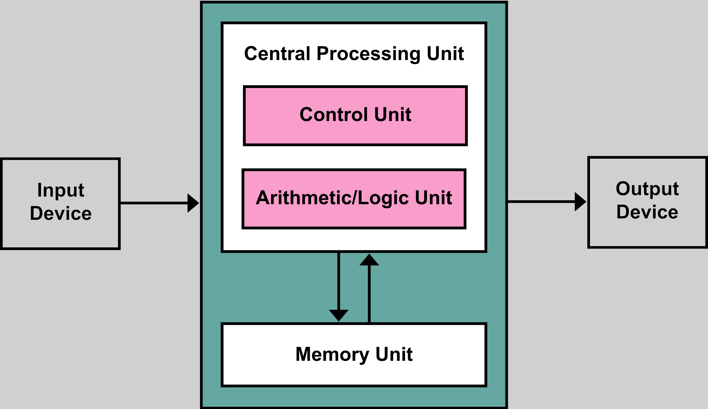

CPU consists of an ALU (Arithmetic Logic Unit) that performs arithmetic operations and a central control unit that sequences operations performed by the machine. Memory on that scheme is responsible for both storing data and instructions and could be imagined as separate RAM and ROM respectively.

With that idea in mind I felt like I could go further in.

### A simple entrypoint - Cartridge header 🎯

You might think that you should start somewhere there - with the core architecture. And most people, including me, would indeed start with the `CPU registers`. But I think there's also a more fun place to start, especially if you were overwhelmed by all of that computer talk just now.

You'll still have to pretty quickly return to all of the CPU stuff, but if you want some fast dopamine, you might start with fetching a `cartridge header`. It's almost like a small separate project, but it'll be of use later on as well. Specifically you'd find the mapper info and built-in RAM info pretty useful.

So what's a `header` anyways?<br>
It's a special dedicated place in the cartridge memory containing some metadata about that cartridge. Stuff like game's name, some entry code, a Nintendo copyright logo and more. You can easily find and inspect it using a hex editor.

Hex editor is an irreplaceable tool in our case. Cartridge data is compiled down to the machine code and our goal is to learn all of the low-level intricacies of the system. Hex editors allow us to look at files or memory byte by byte without breaking a sweat. So we better add it to out toolset.

The header is very well documented [here on Pan Docs](https://gbdev.io/pandocs/The_Cartridge_Header.html). You can follow this documentation byte by byte and pretty soon you'll be able to navigate the header. For example, you can find the logo exactly at the said `0x0104-0x0133` address range, followed by the game's name:

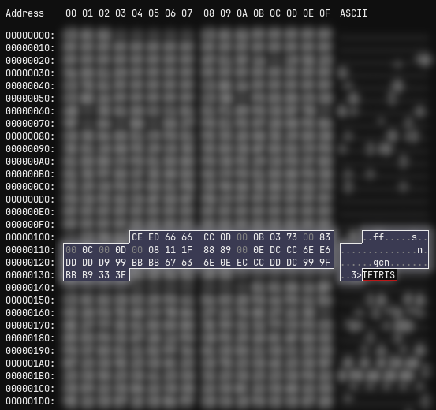

**Tetris**, huh! Neat!<br>
I mean, I knew it's Tetris since I was the one to provide myself with the rom dump. But it's still so nice to see some reassuring text. It basically screams: *"You're on the right track!"*. All we need to do now is to make the program read the cartridge dump and then find and  interpret all of the header bytes on it's own.

> [!NOTE]
> Tetris is generally considered a great test game. It's one of the earliest games and so it's pretty simplistic. Because of that, it doesn't have any of the fancy features a game cartridge could have.

Anyways, just like that after a couple hours of work and roughly 480 (*bruh!*) lines of code I was able to print this:

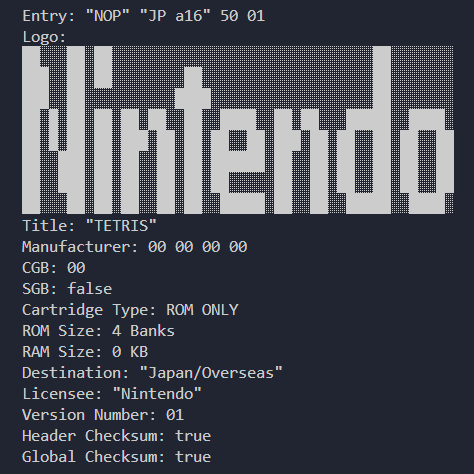

Most I had to do is copy the tables from the documentation as ~~switch-cases~~ match-cases and write the logo renderer. So most of the "code" is occupied by three different match-cases like that:

```rust
 match value {
    0x01 => "Nintendo",
    0x08 => "Capcom",
    0x09 => "HOT-B",
    0x0A => "Jaleco",
    0x0B => "Coconuts Japan",
    0x0C => "Elite Systems",
    0x13 => "EA (Electronic Arts)",
    ...
}
```

With that done you can pat yourself on the shoulder and if you still didn't lose interest, brace yourself to the real deal.

## Brick 1 - Basic architecture 🧩

Okay, fun's over, let the fun begin. Now we're getting to some more complex stuff, but it's gonna be worth it. Let's start with the basics of the basics.

> [!NOTE]
> When talking about memory, I will use <kbd>B</kbd> to signify bytes and <kbd>KB</kbd> to signify kibibytes. Kibibytes are usually shortened to <kbd>KiB</kbd> and one kibibyte equals exactly 1024B, but I'll allow myself some liberty. I hope nobody gets upset over it :3c

### CPU registers 🧾

DMG-01 CPU has 10 different registers: `A B C D E F H L SP PC`. Single letter registers are `8-bit` and double letter registers are `16-bit`. That means they can hold 8 and 16 bits of information respectively. You also can combine single letter registers into the following double letter 16-bit registers: `AF BC DE HL`.<br>
All of the above is actually the entirety of GameBoy's brain, really. At least it's all of the data processor can hold on its own - 12 bytes of data and that's that. 

> [!NOTE]
> Granted, 12B is all it has only in terms of registers and by saying that we ignore `HRAM`, `OAM` and `Wave RAM`. But those are just SRAM regions of the CPU that have little to do with the arithmetics it performs. So we don't really have to concern ourselves with that just now.

Registers `A`, `F`, `HL`, `SP` and `PC` are all special in their own way:
- Register `A` is called "Accumulator" and usually stores results of arithmetical operations
- Register `F` if "Flags register". It only stores data in it's upper nibble (4 leftmost bits) and it's too complex to explain casually
- Register `HL` is oftentimes used by OpCodes to point to an address
- Register `SP` is "Stack Pointer". It stores an address in memory the stack is currently located at
- Register `PC` is "Program Counter". It points to an address the next instruction to execute is located at. It increments with every executed command by the command's byte size

The general way programs work with registers is the following:
1) Load data from RAM/ROM into a register
2) Perform an operation on a register
3) Store the result into RAM

And that's how eventually you get an image on your screen.<br>
You might have noticed `HL`, `SP` and `PC` are commonly used to point to addresses. It's because GameBoy has a `16-bit address space`. It means it only has a `2^16` aka 64KB of available memory to work with. That includes both RAM, ROM and I/O. It's actually quite complicated and you can even access more than 64KB, but we didn't get there just yet.

You might have heard that **GameBoy is an 8-bit system** and so it has an 8-bit processor. But you clearly saw it make use of 16-bit registers just now! But don't you worry, you weren't lied to. Game brick's CPU is indeed 8-bit since it was designed to perform operations on 8-bit registers. The 16-bit registers were a necessity to have a larger  address space and CPU is actually faking 16-bit operations to the best of it's ability using `F` register as a crutch.

Back on track, you can read more on the registers for example [here on Pan Docs](https://gbdev.io/pandocs/CPU_Registers_and_Flags.html).

I was majorly inspired by [this article](https://rylev.github.io/DMG-01/public/book/cpu/registers.html) to implement registers. Once you have two simple structs done just like this, we can go further:

```rust
pub struct Registers {
    pub a: u8,              // Accumulator register, combines with F into AF
    pub b: u8, pub c: u8,   // BC
    pub d: u8, pub e: u8,   // DE
    pub f: FlagsRegister,   // Flags register
    pub h: u8, pub l: u8    // HL can be used to point to an address
}

pub struct FlagsRegister {
    pub zero:       bool,   // Z - Was the result zero?
    pub subtract:   bool,   // N - Was it a subtraction?
    pub half_carry: bool,   // H - Did a 4-bit/8-bit overflow occur?
    pub carry:      bool    // C - Did a 8-bit/16-bit overflow occur?
}
```

### OpCodes 🧠

Now we get to the ~~DNA of the soul~~ heart of the console. **Operation Codes**, or OpCodes for short, describe every single command a CPU can perform. You can find all of them arranged into a nice table [here](https://meganesu.github.io/generate-gb-opcodes/) and read up more on each one of them [here](https://rgbds.gbdev.io/docs/v1.0.1/gbz80.7). These two resources in my opinion should be enough to implement the opcodes.

I personally decided to go by the KISS principle, which says "keep it simple, stupid". And so I re-implemented the OpCode tables three times. First I made an `InstInfo` struct to store the relevant instruction metadata:

```rust
// Cycle length might depend on if opcode conditions were met
pub struct CycleLength {
    pub full: u8,   // If conditions were met
    pub light: u8,  // If conditions weren't met
}

pub struct InstInfo<'a> {
    pub d: &'a str,         // Disassembly
    pub bl: u8,             // Byte length
    pub cl: CycleLength,    // Cycle length
}

...

// Game Boy CPU instructions
pub const MAIN_INST_INFO: [InstInfo; 256] = [
	InstInfo::new_s("NOP",          1, 1), // 0x00
	InstInfo::new_s("LD BC, d16",   3, 3), // 0x01
    InstInfo::new_s("LD (BC), A",   1, 2), // 0x02
    ...
];
// Game Boy CPU instructions for opcodes prefixed by "CB"
pub const SUB_INST_INFO: [InstInfo; 256] = [
    InstInfo::new_s("RLC B", 2, 2), // 0x00
    InstInfo::new_s("RLC C", 2, 2), // 0x01
    InstInfo::new_s("RLC D", 2, 2), // 0x02
    ...
];
```

Just like that I had two constant arrays containing all of the relevant OpCode metadata. It was a lot of copy-paste and quite boring, but it wasn't any difficult.

Next I had to actually implement all of the instructions and that was way more challenging already. I added them one by one to the CPU struct:

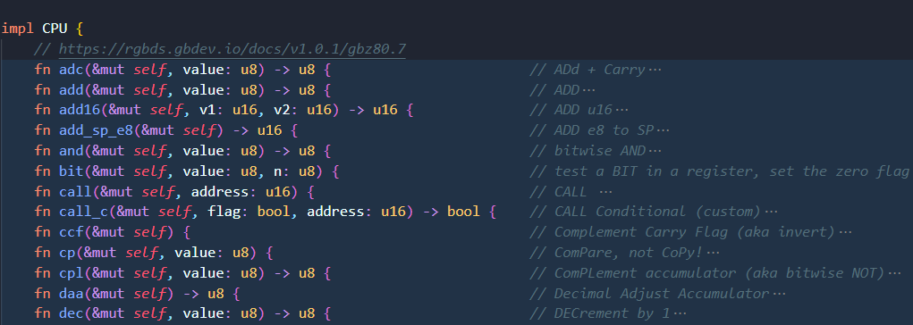

And the third time I had to consult the table religiously was to match the OpCode values to their respective functions:

```rust
 match cmd {
    // Ox0X
    0x00 => { /* NOP, does nothing */ },
    0x01 => self.registers.set_bc(self.fetch16()),
    0x02 => {
        let address = self.registers.get_bc();
        self.mmu.write8(address, self.registers.a);
    },
    0x03 => self.registers.inc_bc(), 
    0x04 => self.registers.b = self.inc(self.registers.b),
    0x05 => self.registers.b = self.dec(self.registers.b),
    0x06 => self.registers.b = self.fetch8(),
    0x07 => self.registers.a = self.rlca(),
    0x08 => self.ld16(self.pc, self.sp),
    ...
}
```

But that's only a half of the story. . .

### Memory 💾

Memory is something I had to implement in parallel with the OpCodes since it's deeply integrated with the CPU. It's actually surprisingly complicated for something described as *"just a big array"*.

If you remember the basic computer model I've shown previously, you might see similarities. We have a CPU that's connected to all kinds of memory. On the CPU itself we have 127B of `High RAM` I told you previously not to worry about! It isn't really different from your general RAM apart from being located directly on the CPU and also being rather tiny. We also have 8KB of `general purpose RAM` and 8KB of `Video RAM` inside of the console. The game cart itself provides a `game's ROM` and might even provide up to 8KB of additional `on-cartridge-RAM`. I know it's a lot of similar words so it might be hard to follow ;p

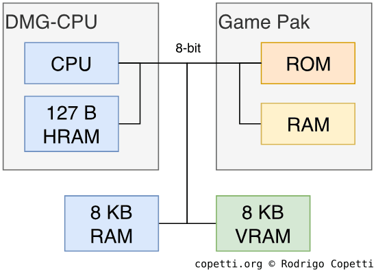

Here you can see the memory chips marked directly on the GameBoy board:

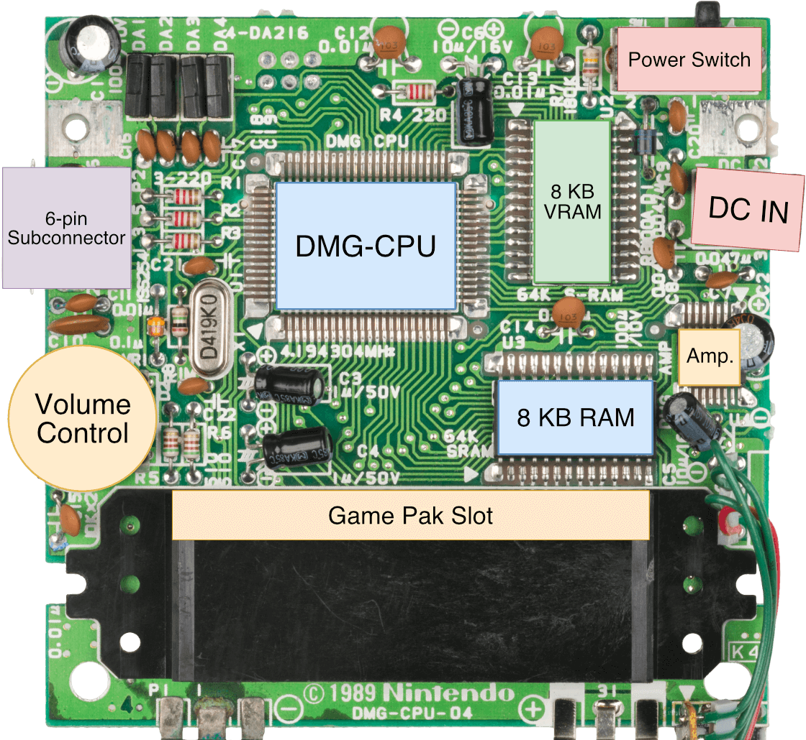

I really like [this breakdown](https://rylev.github.io/DMG-01/public/book/memory_map.html) of different memory regions and their roles. As you can see there, `Game ROM Bank N` section of memory can be used to point to different memory banks. It's done by using special on-cartridge chips called `mappers`. Luckily, the cartridge header can already tell us what kind of mapper the game uses.

I don't really feel like I can say much more about the memory. Just keep in mind that `ROM` is read-only, `RAM` you can both read and write to, `VRAM` is specifically dedicated to displaying graphics and `I/O registers` can be manipulated by the hardware like the screen.

Last thing! It's also worth noting that the the `boot rom` (think of it as bios) is located directly on the CPU die and can be switched on and off by manipulating `0xFF50` memory address. Other than that, we can't really do much with it. Speaking of. . .

### Boot ROM 🥾

Boot rom is the first big milestone. If you can run it, that means you have something functional already. At least it was my personal first big goal for sure. You don't even have to render the graphics, but simply log the CPU state to make sure everything works as expected.

Boot rom is a small 256B program GameBoy runs on every boot and it does a few simple things:
   1) Initialize the hardware
   2) Draw the logo and scroll it down
   3) Play the startup chime: "da-ding!"
   4) Check the logo and header checksum
   5) If everything is alright - unmap, otherwise - loop forever

You can find a more detailed breakdown of it on [this web page](https://knight.sc/reverse%20engineering/2018/11/19/game-boy-boot-sequence.html).

So, once the console starts up, the boot rom would occupy first 256 bytes of memory. So everything in the range of `0x0000-0x00FF` would be occupied by it at first. You might remember the address right after, `0x0100`, is exactly where the cartridge header starts! Isn't that beautiful?

According to [this article](https://realboyemulator.wordpress.com/2013/01/03/a-look-at-the-game-boy-bootstrap-let-the-fun-begin/):

    Writing the value of 1 to the address 0xFF50 unmaps the boot ROM, and the first 256 bytes of the address space, where it effectively was mapped, now gets mapped to the beginning of the cartridge’s ROM.

So those 256 bytes on the cartridge aren't wasted at all. Once boot rom executes, it writes 1 to `0xFF50` address and unloads itself while `PC` register is pointing at `0x0100`. You can clearly see it using a hex editor: 

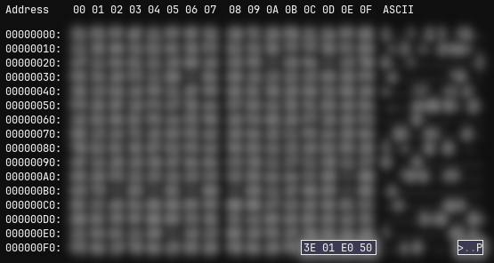

These are the two instructions that are responsible for unloading the boot rom. Instruction <kbd>3E</kbd>, according to the OpCode table, stands for <kbd>LD A, d8</kbd> and it loads d8 value <kbd>01</kbd> into the register `A`. After that we have instruction <kbd>E0</kbd> aka <kbd>LD (a8), A</kbd>, which basically writes value of `A` at the address of <kbd>0xFF00 + d8</kbd>, which in our case is <kbd>50</kbd>. So it writes <kbd>1</kbd> to `0xFF50`. Seems about right! Yatta! And since the last part of the instruction is located at `0x00FF`, it means the `PC` register value is set to the next memory location, which is `0x0100`. That's our entry point! The header is being useful once again!

#### Boot ROM extraction ⛏️

Even though it's not too important for you to know, I want to tell you a short story. It's a story about the way boot rom was extracted, reverse-engineered and dumped.

As I've already mentioned, boot rom is located directly on the CPU die. To get to the boot rom you have to carefully remove the top protective layer of GameBoy's CPU to reveal the circuit underneath. Then you have to look at it under a microscope and find the section dedicated to the boot rom. As you can see on the following picture, boot rom section is a blue rectangle marked <kbd>256 Bytes</kbd>.

Speaking of sections, you can also see the ALU! There's also 127B of `HRAM` + 1B of `IE register` at the end resulting into 128 bytes total. Those two 80 byte regions are dedicated to `OAM`. Lastly, the remaining 16 bytes of SRAM seems to be `Wave RAM` related to audio playback.

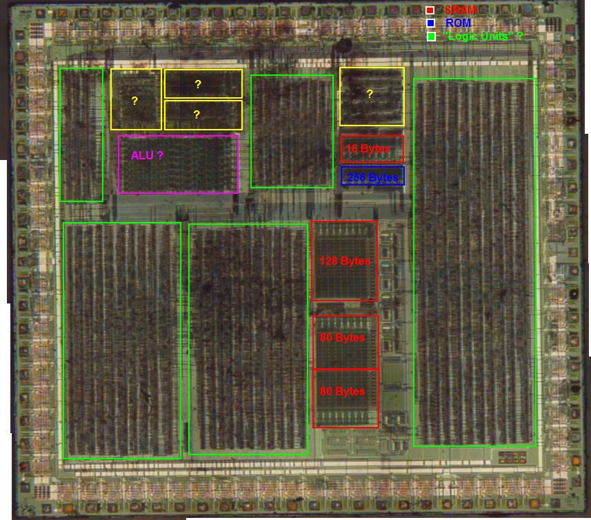

Now that you know where to look, you have to count bits one by one to finally get the data out! As you can see on the picture below the first 8 bits are <kbd>11101011</kbd>, followed by <kbd>11110010</kbd>, and then you can barely not fully see <kbd>11001011</kbd>. And just like that if we read all of the data we get a grid of 128x16 bits or 16x16 bytes. Which gives us exactly 256 bytes we were looking for!

You might pretty quickly figure out that those are <kbd>0xEB</kbd>,<kbd>0xF2</kbd> and <kbd>0xCB</kbd>, instead of desired and even shown on the image <kbd>0x31</kbd>,<kbd>0xFE</kbd> and <kbd>0xFF</kbd>. And you'd be completely and utterly right! It is this way because the bytes here are represented in physical order, but this is quite different from the actual logical order.

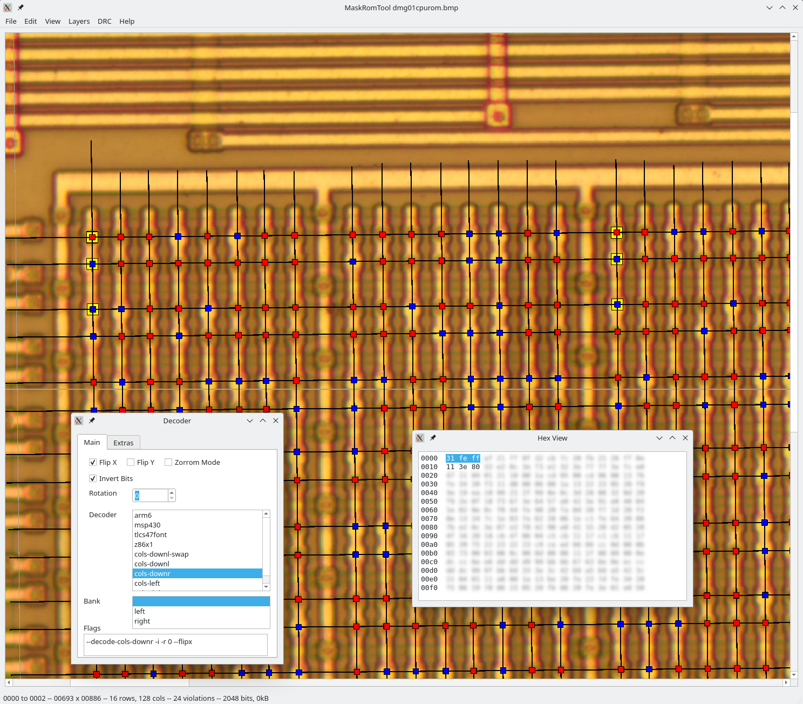

To untangle this mystery let's take first 64 bytes and arrange them in a table grouped by 16 bits.

| Bytes 0-15 | Bytes 16-31 | Bytes 32-47 |
| ---------- | ----------- | ----------- |
| <kbd>11101011 11110010</kbd><br><kbd>11001011 00110010</kbd><br><kbd>01100011 01111100</kbd><br><kbd>00100001 01110010</kbd><br><kbd>11100000 00110011</kbd><br><kbd>11000100 10010010</kbd><br><kbd>11000100 00101111</kbd><br><kbd>00011011 00001000</kbd> | <kbd>01111111 01110011</kbd><br><kbd>01111111 01100011</kbd><br><kbd>00101011 01001111</kbd><br><kbd>00000110 10101011</kbd><br><kbd>00110011 11110011</kbd><br><kbd>00101011 10110000</kbd><br><kbd>00111000 00101110</kbd><br><kbd>11010110 11101111</kbd> | <kbd>00110111 11011011</kbd><br><kbd>01110111 11010111</kbd><br><kbd>01100110 10010111</kbd><br><kbd>01111111 11011010</kbd><br><kbd>01110001 01110010</kbd><br><kbd>01011000 01010111</kbd><br><kbd>01110001 11110111</kbd><br><kbd>01111011 11011000</kbd> |

Now if we read first column of each table top to bottom we get <kbd>11001110</kbd>, <kbd>00000001</kbd> and <kbd>00000000</kbd>. Invert the bits and you get what you were looking for! That's exactly the data we're supposed to have at <kbd>0x00-0x02</kbd>.

```
11001110 -> 00110001 = 0x31
00000001 -> 11111110 = 0xFE
00000000 -> 11111111 = 0xFF
```

It keeps going like that for the remaining 208 bytes and that's why we skip over addresses <kbd>Ox03-0xFF</kbd> and arrive straight at <kbd>0x10-0x12</kbd> if we go over the next column:

```
11101110 -> 00010001 = 0x11
11000001 -> 00111110 = 0x3E
01111111 -> 10000000 = 0x80
```

It's quite fascinating! If you're interested in a more in-depth process, you can read more on it [here](https://github.com/travisgoodspeed/gbrom-tutorial). And for more images you can go to [this old-school website](https://www.neviksti.com/DMG/). I also really enjoyed and can recommend glancing over [this DMG CPU breakdown](https://iceboy.a-singer.de/dmg_cpu_b_map/).

### Faking the screen 📺

To make boot rom work correctly, we need to emulate the screen at least to some extent. To understand why we can accord to the same [boot rom article](https://realboyemulator.wordpress.com/2013/01/03/a-look-at-the-game-boy-bootstrap-let-the-fun-begin/) form before:

    0x0064 – LD A, ($0xFF00+$44) # wait for vertical-blank period
    0x0066 – CP $0x90 # value at 0xFF44 used to determine vertical-blank period
    0x0068 – JRNZ .+0xfa # jump to 0x0064 (loop) if not at vertical-blank period

As you can see there's a piece of code that waits for a VBlank to occur. The easiest hacks we can implement to trick it into working is either writing `0x90` value to the exact address or forcefully returning `0x90` when reading that address just like that:

```rust
pub fn read8(&self, address: u16) -> u8 {
    if address == 0xFF44 { return 0x90; }
    self.memory[address as usize]
}
```

But to do it properly we'd have to implement all of the `Pixel Processing Unit` state machine. I've really enjoyed [this article](https://blog.tigris.fr/2019/09/15/writing-an-emulator-the-first-pixel/) on the topic.

Basically PPU runs in parallel with the CPU and re-renders every `70224 t-cycles`. ~~To make it more clear, imagine a bus stop.~~ **This is a good time to remember that every OpCode takes a certain amount of ***m-cycles*** to execute.** At least that's the values you'd find in the OpCode table. Every *m-cycle* equals four *t-cycles*, so it's a pretty trivial conversion.

For rendering you also need to keep a few things in mind. GameBoy doesn't actually have a framebuffer you would expect if you're familiar with modern graphics rendering process. The first Nintendo console to utilize a framebuffer would be Nintendo 64 and that one came out full 7 years later.<br>
Instead it uses a tile set and a tile map. `Tile` is a single tiny 8x8 image. GameBoy heavily relies on those little fellas to draw graphics. `Tile set` is a memory location that stores all of the different tiles a game uses at the moment. And `tile map` is a memory location filled with IDs of tiles in the tile set arranged in a way we'd want to see them on screen.

For boot rom we only need to care about drawing the `Background tile map 0`. GameBoy looks at the respective location in the memory and gets a tile ID. Then, according to that ID, it gets the correct tile from the tile set and draws it.<br>
And lastly, `SCY` value at `0xFF42` and `SCX` value at `0xFF43` are used for vertical and horizontal scrolling respectfully. Boot rom writes to `0xFF42` to control vertical scrolling.<br>
Fun fact: heavy utilization of tiles will prevail in Nintendo handhelds up Nintendo DS!

> [!IMPORTANT]
> VRAM is a location of memory at `0x8000-0x9FFF`. It occupies 8KB and is dedicated exclusively for storing to be displayed graphics.<br>
> 
> First 6KB of memory  at `0x8000-0x97FF` is reserved for the tile set.<br>
> The rest of the VRAM is split evenly between the two 32x32 tile maps:<br>
> `Background tile map 0` occupies 1KB and is located at VRAM at `0x9800-0x9BFF`.<br>
> `Background tile map 1` occupies 1KB and is located at VRAM at `0x9C00-0x9FFF`.

### Debugging 🐛

Around this point I started testing my emulator against another ones. The best way to do it I found was [this GitHub repository](https://github.com/wheremyfoodat/Gameboy-logs). I was printing results in the same format to a log file and checking them against the verified ones.

During this process I found a few stupid bugs.<br>
First of all, **`CP` register should be updated before command execution and not after**. This was a rather silly one. Then I also had a part of prefixed OpCode table misaligned:

```rust
0x11 => self.registers.b = self.rl(self.registers.b),
0x12 => self.registers.c = self.rl(self.registers.c),
0x13 => self.registers.d = self.rl(self.registers.d),
0x14 => self.registers.e = self.rl(self.registers.e),
0x15 => self.registers.h = self.rl(self.registers.h),
0x16 => self.registers.l = self.rl(self.registers.l),
```

At the time I also was unaware of screen VBlank being important, since I didn't get to writing the display code. And so the cartridge was infinitely looping since the value at `0xFF44` was always 0.

And just like that applying new and new fixes I was moving towards the correct execution. My program stopped at <kbd>24_596</kbd> cycles. Then I got it to <kbd>24_635</kbd> cycles. And then <kbd>28_818</kbd> cycles. A bit later <kbd>29_085</kbd> cycles ran no problem. And then I've gotten to the end! The boot rom was working correctly!

> [!NOTE]
> Here I use <kbd>_</kbd> for the sheer purpose of better readability.<br>So <kbd>24_596</kbd> is just <kbd>24596</kbd>. You can actually do it in Rust as well!

> [!IMPORTANT]
> For the reference, the correct register values after boot are: `A: 01 F: B0 B: 00 C: 13 D: 00 E: D8 H: 01 L: 4D SP: FFFE PC: 00:0100 (00 C3 50 01)`.
> 
> On the contrary, GitHub repository I advised provides the following values: `A: 01 F: B0 B: 00 C: 13 D: 00 E: D8 H: 01 L: 4D SP: FFFE PC: 00:00FE (E0 50 00 C3)`.
> 
> The `PC` there doesn't align with mine, since it only logs the state before executing a command, and not after. And so, I assume, after executing the last boot command, it simply exited without logging.
> 
> The last 4 values are the values at the  following addresses: `(PC), (PC+1), (PC+2), (PC+3)` and so naturally they also wouldn't match.

Only now when I could get to the end of the boot rom successfully I finally started rendering the graphics. I picked a lightweight library called [minifb](https://docs.rs/minifb/latest/minifb/) to get the job done and it was pretty trivial to work with. And now for the moment of truth:


I've accidentally made a slot machine. Some code responsible for working with `SCY` was wrong. Let's try it one more time:


Getting closer. Well, now it scrolls only once and at a correct speed. But it still has some kind of `SCY`-based rendering issue, I suppose. Though, I must admit it looks quite peculiar - I love it!<br>
One last quickfix:


Now we're talking! This is the exact iconic screen I was craving to see! In it's full soundless glory, huh! I guess it's finally time to take a break and relax for the time being. Pheeeew!

### Afterword 🕓

After about a week of work I was able to finish my first actual brick. This took me slightly longer that I initially anticipated. Well, nothing new, huh!

I bet a bunch of people can do it noticeably faster and some will struggle with it way more than me. And that's alright - it's no competition. I started this project to enjoy it and it is insanely rewarding I must say!

But we still have a lot to do. I ignored a bunch of CPU instructions that'll have to be implemented in order for the actual games to run. Things like `DI`, `EI`, `HALT`, `RETI`, `STOP` are yet to be added. If you look at the scheme below, most of them are listed right there under <kbd>"Misc"</kbd> label. Every other instruction in my emulator should already work though!

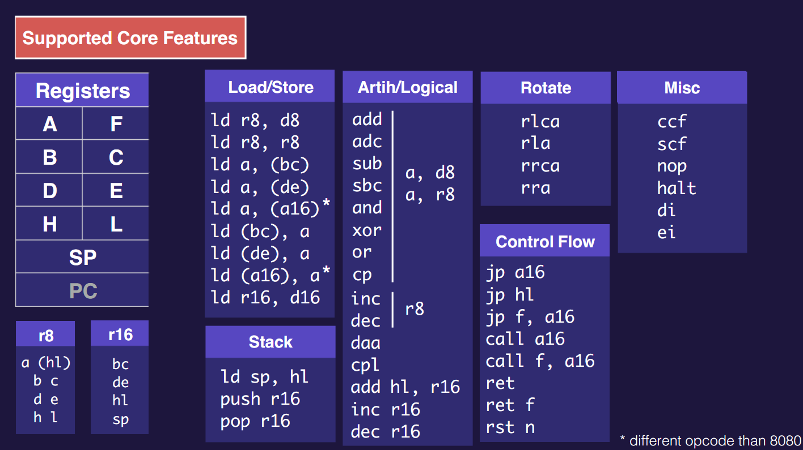

All of these instructions have something to do with interrupts and those I didn't tackle yet. And how could I forget, we still have no sound! I guess I have a few ideas what I'll be working on next time!


## Detour 1 - Piping into FFmpeg 🎬

You might have wondered how I recorded those beautiful gifs you saw just now. And that's what this little detour is all about! Even though it isn't relevant to the emulation itself, a modern emulator in my opinion should feature some video-recording capabilities. I also couldn't miss an opportunity to talk about one of my most beloved utilities.

It wouldn't be an overstatement to call [FFmpeg](https://ffmpeg.org/) a column of not only open-source, but most modern media-related software as a whole. It's a command line utility that allows you to convert between various media formats with ease. And I love it deeply. It's super helpful, small, fast and, most importantly, reliable.

Turns out if you have it installed on your system, you could simply pipe into it directly from your code just like that:

```rust
use std::io::Write; // Required
use std::process::{Command, Stdio}; // Required
use color_eyre::eyre; // My own biased choice

let mut ffmpeg = Command::new("ffmpeg")
    .args([
        "-y",
        // Silent
        "-loglevel", "0",
        // Raw input
        "-f", "rawvideo",
        "-pix_fmt", "rgb24",
        "-video_size", "160x144",
        "-framerate", "60",
        "-i", "-",
        // Encode
        "-c:v", "libx264",
        "-preset", "fast",
        "-crf", "18",
        // Compatibility
        "-pix_fmt", "yuv420p",
        // Output
        "output.mp4",
    ])
    .stdin(Stdio::piped()).spawn()?;

let mut stdin = ffmpeg.stdin.take();
```

Now we can use that stdin to send our frame data to FFmpeg. The library I use works with pixels encoded with a single <kbd>u32</kbd> ARGB value, while FFmpeg is currently set up in a way that expects a long array of single <kbd>u8</kbd> R, G and B values one after another. That's why before we could write to the stdin we need to convert it to the correct format.

```rust
// Convert framebuffer to FFmpeg-compatible format
fn buffer_to_rgb(buffer: &[u32]) -> Vec<u8> {
    let mut rgb = Vec::with_capacity(buffer.len() * 3);
    for pixel in buffer {
        rgb.push(((pixel >> 16) & 0xFF) as u8); // R
        rgb.push(((pixel >> 8) & 0xFF) as u8);  // G
        rgb.push((pixel & 0xFF) as u8);         // B
    }
    rgb
}
// Write framebuffer to FFmpeg
fn write_buffer(stdin: &mut Option<std::process::ChildStdin>, buffer: &[u32]) -> eyre::Result<()> {
    if let Some(stdin) = stdin {
        let rgb = buffer_to_rgb(buffer);
        stdin.write_all(&rgb)?;
    }
    Ok(())
}
```

And so to tie it all together:

```rust
...

// Write framebuffer to FFmpeg
write_buffer(&mut stdin, &buffer)?;

...

// Stop FFmpeg gracefully
drop(stdin.take()); // Close the pipe
ffmpeg.wait()?; // Wait for FFmpeg to finish
```

And just like that we get nice and clean videos we can later convert to gif files using our good old friend FFmpeg. I typically use this small bat file:

```bat
ECHO "%~1"
ffmpeg -i "%~1" -filter_complex "[0:v] palettegen=max_colors=32" palette.png
ffmpeg -i "%~1" -i palette.png -filter_complex "[0:v] fps=30,scale=iw:ih [new];[new][1:v] paletteuse" output.gif
```

What an amazing piece of software.